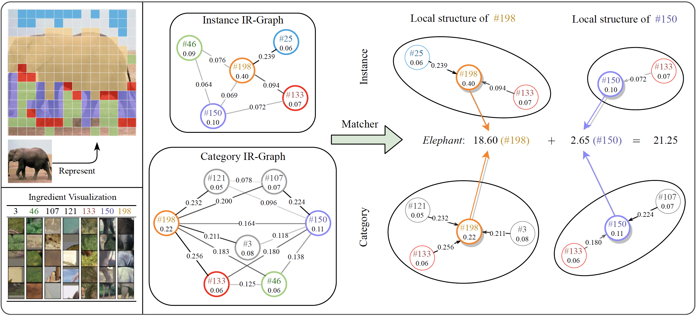

# SchemaNet-Pytorch

*Official implementation for paper [Schema Inference for Interpretable Image Classification](https://openreview.net/forum?id=VGI9dSmTgPF)*

Authors: Haofei Zhang, Mengqi Xue, Xiaokang Liu, Kaixuan Chen, Jie Song, Mingli Song



## Quick Start

### 1. Prepare dataset

* CIFAR: download CIFAR-10/100 dataset to folder `~/datasets/cifar` (you may specify this in configuration files).
* Caltech-101: download Caltech-101 to folder `~/datasets/caltech-101` (you need to manually split it into training and test datasets).
* ImageNet: download ImageNet dataset to folder `~/datasets/ILSVRC2012` and pre-process with this [script](https://gist.githubusercontent.com/antoinebrl/7d00d5cb6c95ef194c737392ef7e476a/raw/dc53ad5fcb69dcde2b3e0b9d6f8f99d000ead696/prepare.sh).

> Please refer to the particular dataset implementation in [this url](https://github.com/zhfeing/cv-lib-PyTorch/tree/schema_inference/cv_lib/classification/data) for more details.

### 2. Prepare cv-lib-PyTorch

Our code requires [cv-lib-PyTorch](https://github.com/zhfeing/cv-lib-PyTorch/tree/bootstrapping_vits). You should download this repo and checkout to tag `schema_inference`.
> `cv-lib-PyTorch` is an open source repo currently maintained by me.

### 3. Requirements

```txt
torch==1.12.1+cu113
torchvision==0.13.1+cu113
tqdm
tensorboard
scipy
PyYAML
pandas
numpy
graphviz
h5py
matplotlib
networkx
pandas
scikit-learn
sklearn
seaborn
```

### 4. Download pre-trained backbone weights

| Backbone | Url |
|-|-|
| DeiT-Tiny | [ckpt](https://1drv.ms/u/s!At6kBY6m_So8umuTwID-4hxlBoqz?e=vhfdDa) |
| DeiT-Small | [ckpt](https://1drv.ms/u/s!At6kBY6m_So8umxzFllFRPa5p14f?e=XCAtBX) |
| DeiT-Base | [ckpt](https://1drv.ms/u/s!At6kBY6m_So8um14xWqooB61f9pR?e=p2zVsT) |

These pre-trained weights are modified from [DeiT Official Repo](https://github.com/facebookresearch/deit/blob/main/README_deit.md) with changing the submodule names for our code. Please download required weights to `CODE_DIR/weights/`

### 5. Build cpp extension

```bash
sh 0.build.sh
```

### 6. Train backbone

```bash
sh 0.train_backbone.sh
```

### 7. Extract ingredients

```bash
sh 1.extract_ingredients.sh
```

### 8. Save JIT files

```bash
sh 2.save_backbone_jit.sh
```

### 9. Initialize SchemaNet

```bash
sh 3.init_schema_net.sh
```

### 10. Train SchemaNet

```bash
sh 4.train_schema_net.sh
```

## Citation

If you found this work useful for your research, please cite our paper:

```txt
@inproceedings{
zhang2023schema,
    title={Schema Inference for Interpretable Image Classification},
    author={Haofei Zhang and Mengqi Xue and Xiaokang Liu and Kaixuan Chen and Jie Song and Mingli Song},
    booktitle={The Eleventh International Conference on Learning Representations},
    year={2023},
    url={https://openreview.net/forum?id=VGI9dSmTgPF}
}
```
